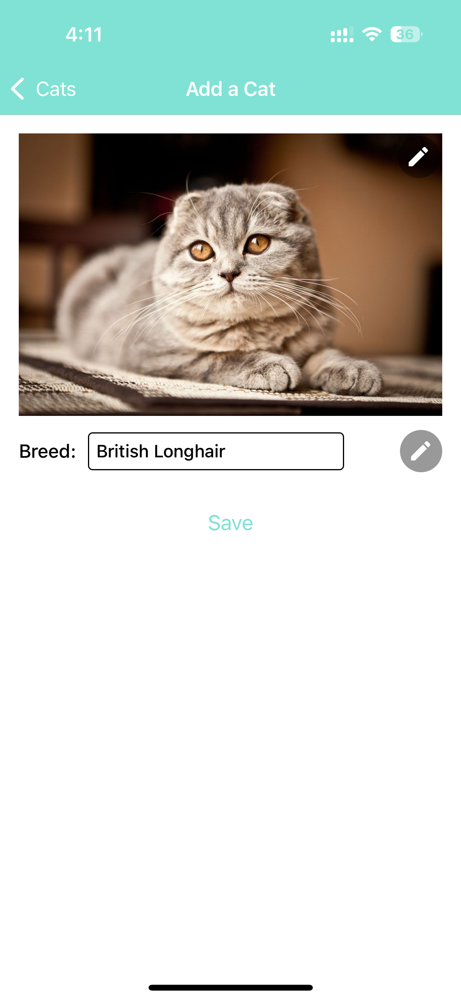
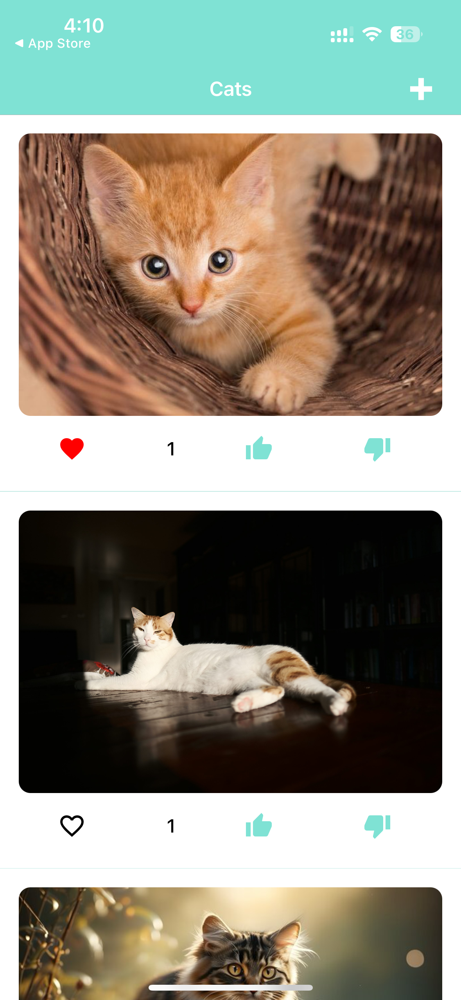

# Catify

**Catify** is an engaging platform for cat enthusiasts to share, vote, and interact with cat images. Upload your favorite cat photos, view others' uploads, and engage by voting and favoriting.

## Features

- **Upload Cat Images**: Easily upload your favorite cat pictures.
- **View Uploaded Cats**: Browse through your own and others' uploaded cat images.
- **Favorite & Unfavorite Cats**: Mark your favorite cat images and remove favorites as desired.
- **Vote on Cats**: Vote cats up or down and see how their scores change.

## Screenshots

### Upload Cat Images



### View Uploaded Cats



## Installation

To get started with Cat Lovers Hub, follow these steps:

1. **Clone the repository:**

   ```bash
   git clone https://github.com/Yugender22/catify
   ```

2. **Navigate into the project directory:**
   
   ```bash
   cd catify
   ```
3. **Install the necessary dependencies:**

   ```bash
   yarn setup
   ```

4. **Start the application:**

   ```bash
   yarn start
   ```
   
5. **To run tests:**

   ```bash
   yarn test
   ```   
